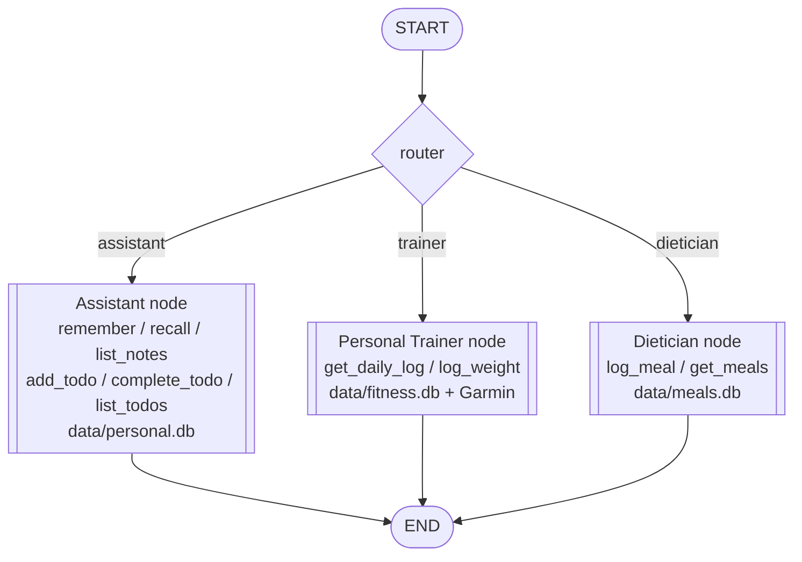

# RAMA - Personal Assistant + Trainer + Dietician

A Telegram bot backed by a local Ollama model and a three-node
[LangGraph](https://langchain-ai.github.io/langgraph/) app: a general
**Assistant** node, a **Personal Trainer** node, and a **Dietician**
node. A small router decides which node handles each message.

## Repo structure

```
trainer/
  config.py        # settings, loaded from .env (Ollama, Garmin, Telegram)
  personal.py       # Assistant node: tools + its own personal.db
  fitness_data.py    # Personal Trainer node: tools + its own fitness.db + Garmin
  dietician.py        # Dietician node: tools + its own meals.db
  graph.py              # LangGraph wiring: all three nodes, the router, checkpointing
  bot.py                 # Telegram long-polling interface
scripts/
  garmin.py                       # pulls steps/sleep/weight/workouts from Garmin Connect into data/fitness.db
tests/                              # pytest suite - mocked, no live Garmin/Telegram/Ollama calls
data/                                  # sqlite files (gitignored): personal.db, fitness.db, meals.db, checkpoints.db
requirements.txt
.env.example
run.bat                                     # starter script
```

## The nodes

- **Assistant** (`trainer/personal.py`) - general chat, plus tools:
  `remember`, `recall`, and `list_notes` for saving/looking up personal
  facts and notes (e.g. "remember my wifi password is X"); and
  `add_todo`, `complete_todo`, and `list_todos` for tracking todos - a
  todo can have a deadline (the assistant reminds you of it when adding
  one), and is either `open` or `done`. Closed todos older than a day
  are purged automatically whenever the list is read. Backed by `notes`
  and `todos` tables in `data/personal.db`.
- **Personal Trainer** (`trainer/fitness_data.py`) - anything about
  workouts, steps, sleep, weight, or Garmin data. Two tools:
  `get_daily_log` (read, runs immediately - steps, sleep, weight, and
  workout summary: type, duration, calories, distance, heart rate) and
  `log_weight` (write - pauses the graph and asks for a yes/no
  confirmation via LangGraph's `interrupt()` before pushing to Garmin
  and the `daily_log` table in `data/fitness.db`).
- **Dietician** (`trainer/dietician.py`) - anything about food, meals,
  calories, or macros. No external food database - when you describe
  what you ate, the model estimates calories and macros (protein/carbs/
  fat) itself from general nutrition knowledge, then calls `log_meal`,
  which pauses the graph and asks you to confirm the calorie estimate
  via LangGraph's `interrupt()` before saving to the `meal_entries`
  table in `data/meals.db`. `get_meals` (read) looks up what's already
  logged for a date, with totals.
- **Router** (`trainer/graph.py`) - one small structured-output call to
  the same Ollama model, classifying each incoming message as
  `assistant`, `trainer`, or `dietician` before it's dispatched.

Conversation history and any pending confirmation persist across bot
restarts in `data/checkpoints.db` - LangGraph's own checkpoint database,
keyed by Telegram chat id.

## Node graph



## Setup

```bash
pip install -r requirements.txt
cp .env.example .env         # fill in Garmin, Telegram, Ollama settings
python scripts/garmin.py --days 30   # backfill Garmin data (get_daily_log/log_weight read this)
run.bat                                # or: python -m trainer.bot
```

Re-run `garmin.py` on a schedule (e.g. cron) to keep fitness data
current - the bot never fetches from Garmin for reads, only this script
does. Meals have no external source; they're logged straight from
conversation with the Dietician node.

## Running the tests

```bash
pytest -q
```
