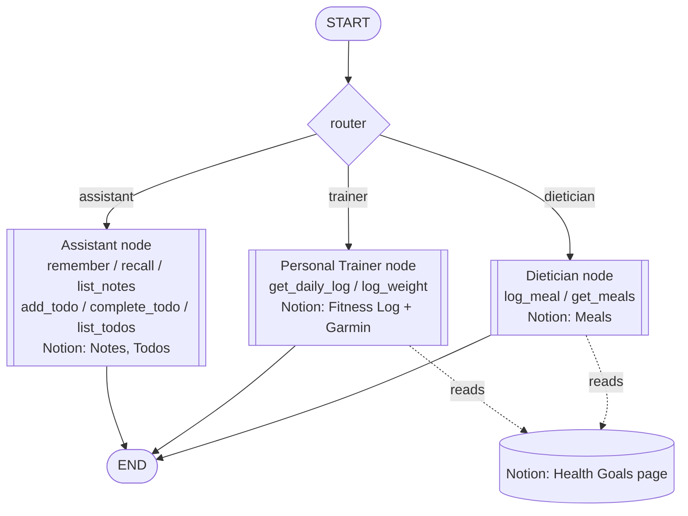

# RAMA - Personal Assistant + Trainer + Dietician

A Telegram bot backed by a local Ollama model and a three-node
[LangGraph](https://langchain-ai.github.io/langgraph/) app: a general
**Assistant** node, a **Personal Trainer** node, and a **Dietician**
node. A small router decides which node handles each message. **Notion
is the source of truth** for notes, todos, the fitness log, and meals -
every read/write tool call talks to Notion directly, not a local
database.

## Repo structure

```
trainer/
  config.py        # settings, loaded from .env (Ollama, Garmin, Telegram, Notion)
  notion.py          # thin Notion REST client - the only place any tool talks to Notion from
  personal.py         # Assistant node: tools, backed by the Notion Notes + Todos databases
  fitness_data.py       # Personal Trainer node: tools, backed by the Notion Fitness Log database + Garmin
  dietician.py            # Dietician node: tools, backed by the Notion Meals database
  graph.py                  # LangGraph wiring: all three nodes, the router, checkpointing, Health Goals context
  bot.py                     # Telegram long-polling interface
scripts/
  garmin.py                       # pulls steps/sleep/weight/workouts from Garmin Connect into the Notion Fitness Log
tests/                              # pytest suite - local only, not tracked in git (see .gitignore)
data/                                  # checkpoints.db only (gitignored) - LangGraph's own conversation-state DB
requirements.txt
.env.example
run.bat                                     # starter script
```

## The nodes

- **Assistant** (`trainer/personal.py`) - general chat, plus tools:
  `remember`, `recall`, and `list_notes` for saving/looking up personal
  facts and notes (e.g. "remember my wifi password is X"), backed by a
  dedicated Notion **Notes** database; and `add_todo`, `complete_todo`,
  and `list_todos` for tracking todos, which **reuse your existing
  Notion Todos database** - the bot sees and manages the same list you
  already have there, not a separate shadow list. A todo can have a
  deadline (the assistant reminds you of it when adding one), and is
  either `open` or `done` (mapped from Notion's Status property).
  Todos left `Done` for over a day are archived in Notion automatically
  whenever the list is read.
- **Personal Trainer** (`trainer/fitness_data.py`) - anything about
  workouts, steps, sleep, weight, or Garmin data. Two tools:
  `get_daily_log` (read, runs immediately - steps, sleep, weight, and
  workout summary: type, duration, calories, distance, heart rate) and
  `log_weight` (write - pauses the graph and asks for a yes/no
  confirmation via LangGraph's `interrupt()` before pushing to Garmin
  and the Notion **Fitness Log** database).
- **Dietician** (`trainer/dietician.py`) - anything about food, meals,
  calories, or macros. No external food database - when you describe
  what you ate (one meal, or every meal of the day in one message), the
  model estimates calories and macros (protein/carbs/fat) itself from
  general nutrition knowledge for each distinct item, then calls
  `log_meal` once per item, which pauses the graph and asks you to
  confirm that item's full macro estimate via LangGraph's `interrupt()`
  before saving to the Notion **Meals** database (several meals means
  several separate confirmations, not one batch). `log_meal`'s result
  includes the day's running totals so far, and the model always follows
  up with a short comment on the meal itself - not just "logged it" -
  weighed against the health goals below. `get_meals` (read) looks up
  what's already logged for a date, with totals.
- **Router** (`trainer/graph.py`) - one small structured-output call to
  the same Ollama model, classifying each incoming message as
  `assistant`, `trainer`, or `dietician` before it's dispatched.

**Health Goals context:** the Personal Trainer and Dietician both fetch
a plain Notion **page** (not a database) called "Health Goals" fresh on
every message and prepend it to their system prompt - your actual
targets (goal weight, calorie/macro targets, workout plan, etc.) live
there in prose/bullets, edited directly in Notion, never hardcoded or
duplicated into this repo. The Assistant node doesn't use it.

Conversation history and any pending confirmation persist across bot
restarts in `data/checkpoints.db` - LangGraph's own checkpoint database,
keyed by Telegram chat id. This is the only local database left; it's
LangGraph's internal state, not app data, so it stays local regardless.

## Node graph



## Setup

1. Create a Notion integration at [notion.so/my-integrations](https://www.notion.so/my-integrations), copy its token.
2. Share the relevant Notion pages/databases with that integration (the existing Todos database, and the page you'll use as Health Goals) - new databases created by this app will already be shared with it since it creates them.
3. Fill in `.env` (see `.env.example`): `NOTION_TOKEN`, plus the database/page IDs (`NOTION_TODOS_DB_ID`, `NOTION_NOTES_DB_ID`, `NOTION_FITNESS_DB_ID`, `NOTION_MEALS_DB_ID`, `NOTION_HEALTH_GOALS_PAGE_ID`). The Notes/Fitness Log/Meals databases need to exist in Notion first - create them with the properties listed under **The nodes** above.

```bash
pip install -r requirements.txt
cp .env.example .env         # fill in Garmin, Telegram, Ollama, Notion settings
python scripts/garmin.py --days 30   # backfill Garmin data into the Notion Fitness Log
run.bat                                # or: python -m trainer.bot
```

Re-run `garmin.py` on a schedule (e.g. cron) to keep fitness data
current - the bot never fetches from Garmin for reads, only this script
does. Meals have no external source; they're logged straight from
conversation with the Dietician node.

## Running the tests

`tests/` exists locally but isn't tracked in git - it's yours to run,
not part of what gets pushed:

```bash
pytest -q
```

Notion access is mocked at the `trainer.notion` function boundary in
every test - no test call ever reaches the real Notion API, Garmin, or
Ollama.
